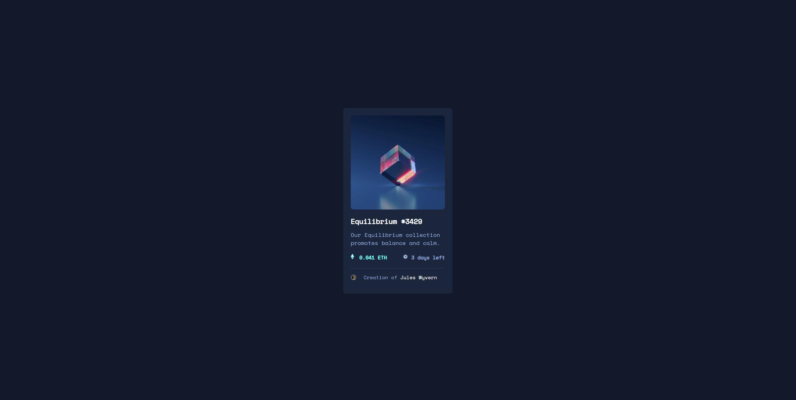

This is a solution to the [NFT preview card component challenge on Frontend Mentor](https://www.frontendmentor.io/challenges/nft-preview-card-component-SbdUL_w0U). Frontend Mentor challenges help you improve your coding skills by building realistic projects. 

## Table of contents

- [Overview](#overview)
  - [Screenshot](#screenshot)
  - [Links](#links)
- [My process](#my-process)
  - [Built with](#built-with)
  - [What I learned](#what-i-learned)
  - [Continued development](#continued-development)
  - [critic] (#critic)

**Note: Delete this note and update the table of contents based on what sections you keep.**

## Overview

### Screenshot

### Links

- Solution URL:(https://github.com/Nazemrap/NFTCard)
- Live Site URL:(https://nazemrap.github.io/Frontend_Mentor.io/)

### Built with

With the help of VCS Studio
- HTML5
- CSS

### What I learned

Main difficulty was to get the little eye icone poping out of the NFT image. I had to cheat a little bit and check on other people. 
I found out the ::before ::after thing and after checking on few youtube video, i tried to do it my self but it was a bit hard for me. 

Also i learned a little bit more on the importance of the Mother and chill interaction, figured out that depending on who we apply style it might interact differently. 

### Continued development

I tryed to work a bit more with the flex box. I'm using black border now to see how block are and how they interact with each other. 

### Critic

On the final result, i'm happy overall, but there is still this imperfect thing:  the ETH and clock are not quite aline with the text next to it. 
